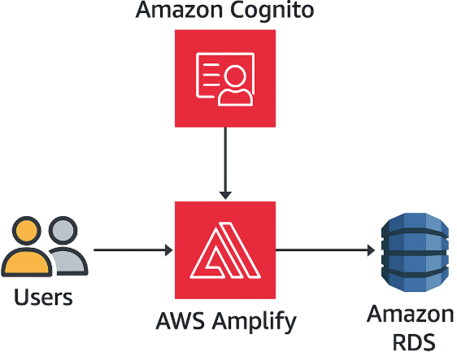

RELATÓRIO DE IMPLEMENTAÇÃO DE SERVIÇOS AWS
Data: 11/01/2026
Empresa: Abstergo Industries
Responsável: Marcelo A. N.

Introdução
Este relatório apresenta o processo de implementação de ferramentas na empresa Abstergo Industries, realizado por Marcelo A. N. O objetivo do projeto foi selecionar três serviços da AWS com a finalidade de promover a redução imediata de custos operacionais e otimizar a infraestrutura tecnológica da empresa.

Descrição do Projeto
O projeto de implementação foi dividido em três etapas, cada uma com objetivos específicos voltados à segurança, escalabilidade e eficiência de dados.

Etapa 1:
Amazon Cognito

Foco: Autenticação e gerenciamento de usuários

Descrição de caso de uso: Implementação de login seguro para usuários internos e externos, com autenticação multifator e integração com provedores de identidade. Reduziu custos com soluções terceirizadas de autenticação.

Etapa 2:
AWS Amplify

Foco: Hospedagem de aplicações web

Descrição de caso de uso: Utilizado para desenvolver e hospedar o frontend da aplicação corporativa, com integração direta ao GitHub e deploy automatizado. Eliminação de servidores dedicados para hospedagem estática.

Etapa 3:
Amazon RDS

Foco: Banco de dados relacional gerenciado

Descrição de caso de uso: Migração do banco de dados local para o Amazon RDS, com escalabilidade automática, backups integrados e alta disponibilidade. Redução de custos com manutenção de infraestrutura física.

Conclusão
A implementação das ferramentas na empresa Abstergo Industries trouxe benefícios como maior segurança, escalabilidade e redução de custos operacionais. Espera-se que essas melhorias aumentem a eficiência e a produtividade da equipe. Recomenda-se a continuidade da utilização dos serviços implementados e a busca por novas soluções tecnológicas que possam aprimorar ainda mais os processos internos.

Anexos
Manual de integração Cognito

Documentação de deploy AWS Amplify

Planilha de migração para Amazon RDS

Assinatura do Responsável pelo Projeto:  
Marcelo A. N.